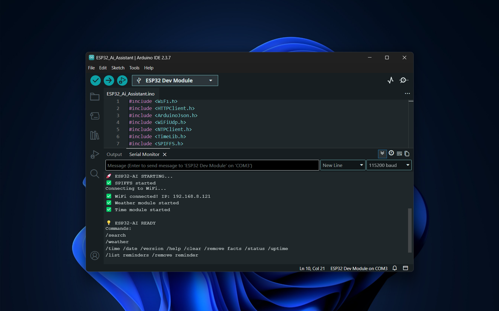

# **ESP32-AI-S3 Assistant**

**Author:** Sethun Vithanawasam  
**Version:** 1.5  
**Platform:** Arduino IDE  
**Language:** Arduino / C++  

---

## **Project Overview**

The **ESP32-AI-S3 Assistant** is an interactive, intelligent assistant that runs entirely on an ESP32 microcontroller. It allows users to communicate with AI, manage reminders, check weather, perform web searches, monitor system status, and more — all through the Arduino Serial Monitor.

Unlike typical AI projects that require a full PC or cloud interface, this assistant leverages the ESP32’s capabilities to provide a compact, versatile solution. While interaction occurs via a connected computer or mobile device, the ESP32 handles memory, reminders, and real-time responses independently.

Key functionalities include:  

- **Chat with AI:** Send messages and receive intelligent responses using OpenAI’s GPT API.  
- **Memory system:** Teach the assistant facts, which it can recall later. Memory persists even after power loss.  
- **Reminders:** Schedule one-time or daily reminders, with visual and Serial Monitor notifications.  
- **Weather updates:** Fetch current weather for any city, including temperature, feels-like temperature, and cloud coverage.  
- **Web search:** Summarize top Google search results directly in the Serial Monitor.  
- **System diagnostics:** Check WiFi status, IP address, CPU temperature, and uptime.  
- **Time and date:** Track and display local time and date using NTP synchronization.  
- **LED notifications:** Visual feedback for AI responses and reminders via the ESP32’s built-in LED.  

---

## **Key Features**

### **AI Chat**
- Supports natural language conversations using OpenAI GPT API.  
- Special commands available to query system status, uptime, time, date, and software version.  

### **Memory System**
- Teach the assistant facts with simple commands like `remember that <key> is <value>`.  
- Facts are persistent and remain stored even after a power cycle.  

### **Reminders**
- Schedule reminders for any time.  
- Supports both one-time and daily alerts.  
- Notifications appear in the Serial Monitor, with blinking LED feedback.  

### **Weather Updates**
- Fetches real-time weather for any city using Meteosource API.  
- Displays temperature, feels-like temperature, and cloud cover in a readable format.  

### **Web Search**
- Performs Google searches through Google Custom Search API.  
- Summarizes top results for quick reference in the Serial Monitor.  

### **System Diagnostics**
- Monitors WiFi connectivity, local IP, CPU temperature, and system uptime.  

### **Time and Date**
- Uses NTP to maintain accurate local time.  
- Displays current time and date on demand.  

### **LED Notifications**
- Visual cues for AI responses and reminders.  
- LED blink patterns for alerts.  

---

## **Requirements**

To run **ESP32-AI-S3 Assistant**, you will need:  

- An ESP32-S3 development board (e.g., DevKit)  
- Arduino IDE installed on your PC  
- Internet access via WiFi  
- Required Arduino libraries for:  
- WiFi.h
- HTTPClient.h 
- ArduinoJson.h 
- WiFiUdp.h 
- NTPClient.h
- TimeLib.h 
- SPIFFS 
- FS.h 
- vector 
- algorithm    

---

## **APIs Used**

The assistant integrates with three main APIs. Each requires an API key:

### **OpenAI GPT API**
- Enables sending messages to GPT and receiving intelligent responses.  
- Requires signing up on OpenAI’s website and generating a key.  

### **Weather API (Meteosource)**
- Provides current weather information for any location.  
- Requires creating a free account and obtaining an API key.  

### **Google Custom Search API**
- Allows performing Google searches and summarizing results.  
- Requires creating a project on Google Cloud Console, enabling the Custom Search API, generating a key, and creating a Custom Search Engine ID.  

---

## **Setup Instructions**

1. Install Arduino IDE and ensure ESP32 board support is added.  
2. Open the `.ino` file in Arduino IDE.  
3. Add your personal API keys at the top of the code for OpenAI, Meteosource, and Google Search.  
4. Connect your ESP32 board via USB, select the correct board and port, and upload the code.  
5. Open the Serial Monitor at 115200 baud. Wait for the welcome message.  
6. Start interacting with the assistant using commands or natural language.  

---

## **Demo Screenshots**

### ESP32-AI-S3 Boot Sequence
  
ESP32 initializing SPIFFS, WiFi, weather, and time module.

### AI Chat Interaction
  
Serial Monitor showing AI assistant responding (Hello).

---

## **Safety and Privacy**

- Keep all API keys secure and private.    
- For public sharing, replace API keys with placeholders.  

---

## **Credits**

- **Created by:** Sethun Vithanawasam  
- **Uses:** OpenAI GPT API, Meteosource API, and Google Custom Search API  
- **Powered by:** ESP32-S3 and Arduino IDE
