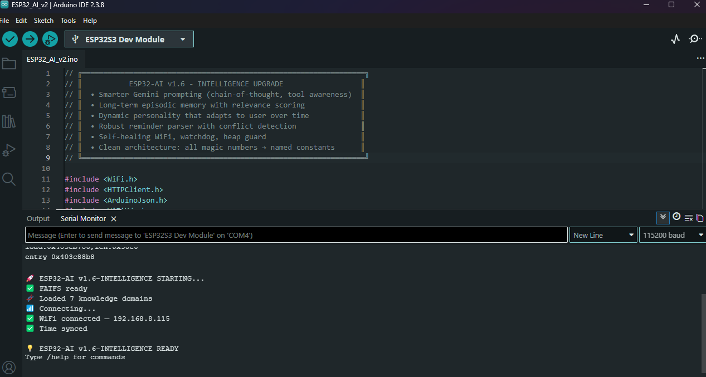
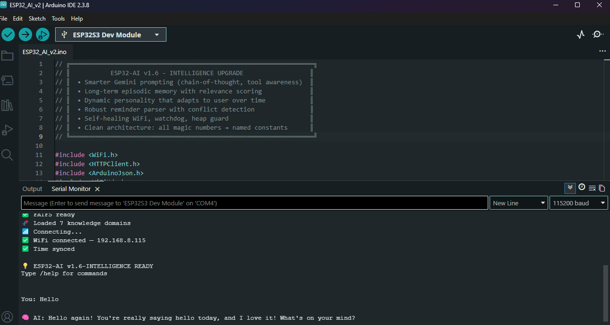
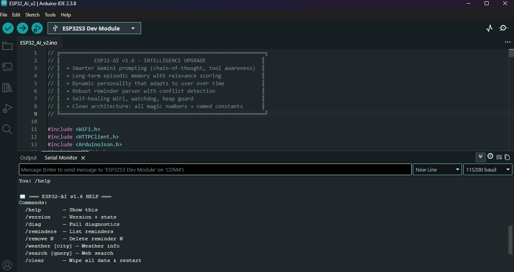
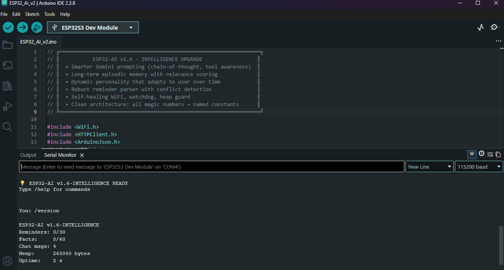
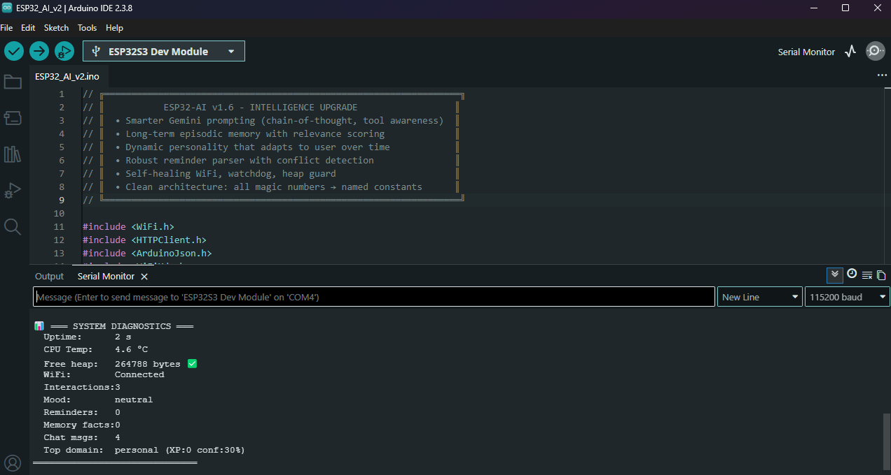

# **ESP32-S3-AI Assistant**

**Author:** Sethun Vithanawasam  
**Version:** 1.6  
**Platform:** Arduino IDE  
**Language:** Arduino / C++  

---

## **Project Overview**

The **ESP32-AI Assistant** is an interactive, intelligent assistant that runs entirely on an ESP32 microcontroller. It allows users to communicate with AI, manage reminders, check weather, perform web searches, monitor system status, and more — all through the Arduino Serial Monitor, with LED feedback for AI states.

Unlike typical AI projects that require a full PC or cloud interface, this assistant leverages the ESP32’s capabilities to provide a compact, versatile solution. While interaction occurs via a connected computer or mobile device, the ESP32 handles memory, reminders, and real-time responses independently.

Key functionalities include:  

- **Chat with AI:** Natural language conversations powered by Google Gemini API.  
- **Memory system:** Long-term fact storage with relevance scoring, persistent across reboots using FATFS.  
- **Reminders:** Schedule one-time, daily, weekly, or monthly reminders with conflict detection.  
- **Weather updates:** Fetch current weather for any city.  
- **Web search:** Summarize Google search results when Gemini is uncertain.  
- **System diagnostics:** Check WiFi status, IP address, CPU temperature, heap safety, and uptime.  
- **Time and date:** Track and display local time and date using NTP synchronization.  
- **LED notifications:** Visual feedback for AI states and reminders via NeoPixel LED.  
- **Resilience:** Watchdog timer, heap guard, and self-healing WiFi for stability.  

---

## **Key Features**

### **AI Chat**
- Supports natural language conversations using Google Gemini API.  
- Adaptive personality tone (technical, casual, or organized) based on usage patterns.  
- Retry logic and uncertainty detection with web search fallback.  

### **Memory System**
- Teach the assistant facts with simple commands.  
- Facts are persistent and prioritized by relevance scoring.  

### **Reminders**
- Schedule reminders for any time.  
- Supports one-time, daily, weekly, and monthly recurrence.  
- Notifications appear in the Serial Monitor, with LED blink feedback.  

### **Weather Updates**
- Fetches real-time weather using API integration.  

### **Web Search**
- Performs Google searches through Custom Search API.  
- Summarizes top results for quick reference.  

### **System Diagnostics**
- Monitors WiFi connectivity, local IP, CPU temperature, heap status, and uptime.  

### **Time and Date**
- Uses NTP to maintain accurate local time (Sri Lanka UTC+5:30).  
- Displays current time and date on demand.  

### **LED Notifications**
- NeoPixel LED visualizes AI states (thinking, replied, error, proactive, evolving).  

### **Resilience**
- Watchdog timer prevents stalls.  
- Heap guard ensures safe memory usage.  
- Auto-reconnect for WiFi.  

---

## **Requirements**

To run **ESP32-AI Assistant**, you will need:  

- An ESP32 development board (ESP32-S3 or standard DevKit)  
- Arduino IDE installed on your PC  
- Internet access via WiFi  
- Required Arduino libraries for:  
  - WiFi.h  
  - HTTPClient.h  
  - ArduinoJson.h  
  - WiFiUdp.h  
  - NTPClient.h  
  - TimeLib.h  
  - FFat / FS.h  
  - Adafruit_NeoPixel  
  - vector  
  - algorithm  

---

## **APIs Used**

The assistant integrates with three main APIs. Each requires an API key:

### **Google Gemini API**
- Provides conversational intelligence.  
- Requires a Google API key.  

### **Weather API**
- Provides current weather information for any location.  
- Requires an API key.  

### **Google Custom Search API**
- Allows performing Google searches and summarizing results.  
- Requires a Google API key and Custom Search Engine ID.  

---

## **Setup Instructions**

1. Install Arduino IDE and ensure ESP32 board support is added.  
2. Open the `.ino` file in Arduino IDE.  
3. Add your personal API keys at the top of the code for Gemini, Weather, and Google Search.  
4. Connect your ESP32 board via USB, select the correct board and port, and upload the code.  
5. Open the Serial Monitor at 115200 baud. Wait for the welcome message.  
6. Start interacting with the assistant using commands or natural language.  

---

## **Demo Screenshots**

### ESP32-AI Boot Sequence
  
ESP32 initializing FATFS, WiFi, weather, and time module.

### AI Chat Interaction
  
Serial Monitor showing AI assistant responding (Hello).

### AI Commands

### AI Version Commands

### AI System Diag

---

## **Safety and Privacy**

- Keep all API keys secure and private.    
- For public sharing, replace API keys with placeholders.  

---

## **Credits**

- **Created by:** Sethun Vithanawasam  
- **Uses:** Google Gemini API, Weather API, and Google Custom Search API  
- **Powered by:** ESP32 and Arduino IDE  
